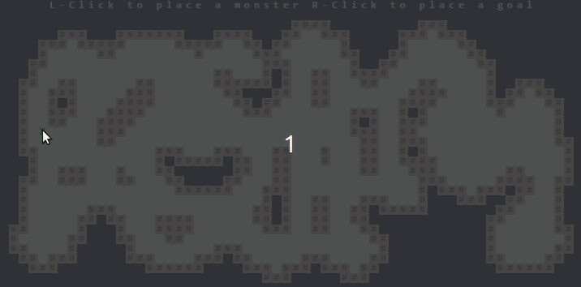

# Pathfinding in Video Games

A demonstration of path finding in video games.  The presentation is in the form
of a long code example written in Rust and `tcod`.   Once you have seen the
presentation, you can look into the source code to learn more about the
pathfinding algorithms used.

You may have noticed some of the paths in the demo do not seem distance optimal.
They are instead _tun_ optimal as intended, as moving diagonally has the same
turn cost as moving vertically.

## Download a Release

Go to the [releases][releases] page and find a download suitable for your OS.

## Building the Presentation

With the rust tool-chain installed, clone the repository and build it with
cargo:

```
$ git clone https://github.com/glfmn/path_demo.git
$ cd path_demo
$ cargo run --release
```

There are some dependencies which must be installed for [`libtcod`] which can be found on the [`libtcod` README][dependencies].

## Presentation Controls

| Key               | Function                                               |
|:-----------------:|:-------------------------------------------------------|
| `Left Click`      | Place the monster icon (`M`) under the cursor          |
| `Right Click`     | Place the player, or goal, icon (`@`) under the cursor |
| `Enter`           | Step through one iteration of path-finding             |
| `Shift` + `Enter` | Path-find until the final path is found                |
| `Backspace`       | Restart path-finding from the beginning                |
| `Delete`          | Generate a new map                                     |

[`libtcod`]: https://github.com/tomassedovic/tcod-rs
[dependencies]: https://github.com/tomassedovic/tcod-rs/blob/master/README.md#how-to-use-this
[releases]: https://github.com/glfmn/path_demo/releases
